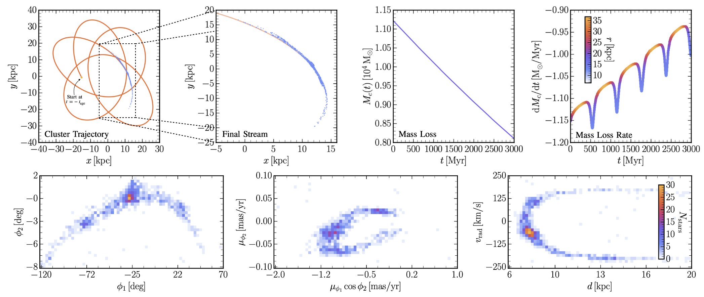

----
## Description

- **sstrax** is a [jax](https://github.com/google/jax)-accelerated library designed to perform fast simulations of Milky Way stellar stream formation. It is desgined to be integrated with the [albatross](https://github.com/undark-lab/albatross) simulation-based inference code to perform complete parameter inference on stellar streams.
- **Contacts:** For questions and comments on the code, please contact either [James Alvey](mailto:j.b.g.alvey@uva.nl) or [Mathis Gerdes](mailto:m.gerdes@uva.nl). Alternatively feel free to open an issue.
- **Related paper:** The details regarding the implementation of `sstrax` and the physics modelling choices can be found in the companion paper.
- **Citation:** If you use **sstrax** in your analysis, or find it useful, we would ask that you please use the following citation.
```
@article{...}
```

----
## Installing `sstrax`

`sstrax` is designed to be installed as a standard python package, so can be obtained using the following process

- Change directory to wherever you would like to store the library, then run:
```
git clone https://github.com/undark-lab/sstrax.git # for https client
[or git clone git@github.com:undark-lab/sstrax.git # for ssh client]
```
- Making sure that the desired python environment is active, run the following installation code:
```
cd sstrax/
pip install .
```
- This will install `sstrax` in the current python environment that is active on your system and will be available via `import sstrax`
- This library requires `jax` and `jaxlib` which will be installed as default from the requirements if they are not already present in your python installation
- *Note:* If you are interested in local development, it is probably advisable to run `pip install -e .` instead which will then track the main directory rather than creating a copy
- *Note (April 2023):* Hopefully this will soon be available as a PyPI package and then be possible to be installed directly via `pip install sstrax`

----
## Running `sstrax`



First, import the module with `import sstrax`, then to simply generate a stream with the default parameters given in [`sstrax/constants.py`](./sstrax/constants.py), run:
```
import jax, time
stream = sstrax.simulate_stream(key=jax.random.PRNGKey(time.time_ns()), 
                                params=st.Parameters())
```
- This outputs a list of stars in a jax array of shape `(6, N_stars)` where `N_stars` is a dynamically computed quantity based on the mass loss, and the columns are the phase space co-ordinates $(x, y, z, v_x, v_y, v_z)$ defined in the [`sstrax/projection.py`](./sstrax/projection.py) module. Projections to other co-ordinate frames (including the velocity jacobain transformations) are available in the same module.
- Details and examples for running each of the individual functions can be found in the relevant docstrings throughout the code.
- **Compilation:** Note that the first time you run this code, the `jax` jit compiler willl be functional. In practice this means that the initial run will be much (orders of magnitude slower - around 10s for the first iteration, and around 100ms for future iterations) slower than subsequent calls.
- **Important:** One of the distinct features of `jax` compared to e.g. `numpy` is that you must specify and handle your own random seed generation. Most of this management is done internally, but to run an individual simulation, you must specify and generate your own key. The above example shows one way to do this simply by using the `time.time_ns()` command as a random seed. For debugging purposes, however, it might actually be preferable to fix the value e.g. `key = jax.random.PRNGKey(0)` so that the same realisation is generated every time.

----
## Current Implementation

The code is currently structured into the following files:

- [`backgrounds.py`](./sstrax/backgrounds.py) | Implementation of the relevant forces from the Milky Way disk, bulge, and NFW halo. Automic computation of the force derivative relevant to the tidal stripping formalism using `jax` autodifferentiation functionality.
- [`constants.py`](./sstrax/constants.py) | Definition of various constants, unit conversions (N.B. Default units throughout the code are: Mass $\mathrm{[M}_\odot\mathrm{]}$, Length $\mathrm{[kpc]}$, and Time $\mathrm{[Myr]}$), and parameter data structures. These are implemented in the `chex` data class format and can be modified via e.g. `params = st.Parameters(xc=10.5, alpha=14.9)`. Also defines the parameters relevant to the Milky Way gravitational potential.
- [`ode.py`](./sstrax/ode.py) | Implementation of the two differential equation solvers (one for the dynamics in the gravitational potential, and one for solving the mass loss equation). Implemented using the [`diffrax`](https://github.com/patrick-kidger/diffrax) module.
- [`projection.py`](./sstrax/projection.py) | Definition of the various co-ordinate transformations from the simulation frame (a Cartesian system with origin at the galactic centre) to other frame such as galactic and equatorial angular co-ordinates, or the GD1-centric stream co-ordinates. Uses the `jax` autodifferentiation functionality to automatically compute the relevant jacobians for transforming velocities between frames.
- [`stream.py`](./sstrax/stream.py) | Definition of the full stream simulation code that inherits functionality from other modules. Key function is `simulate_stream` which can be called as defined above.
- [`tidal.py`](./sstrax/tidal.py) | Definition and implementation of the tidal stripping model including computations of the Lagrange radius, and a sampling class to generate radnom stripping times given a mass evolution history.

----
## Release Details

- **v0.0.1** | *April 2023* | Initial release based on [arXiv:2004.xxxx]()
